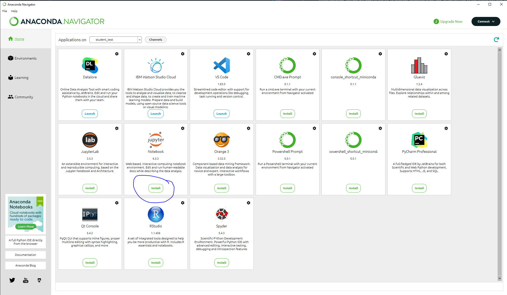
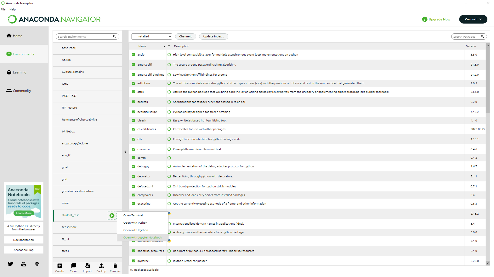
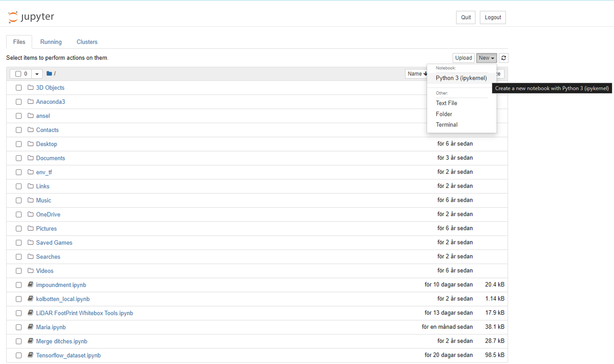

# Analyses-of-Environmental-Data-2
Welcome to the second edition of Analysis of Environmental Data 2! Analysis of Environmental Data 1 used R for data analysis but this course will use Python and Jupyter Notebooks instead. This course will also take it a step further and dive into the world of spatial data and machine learning.

The course focuses on applying statistical models and machine learning methods to spatial data. The course will cover four topics:\
**1 Setting up your analytical envrionment** \
**1 Acquiring and wrangling real data** \
**2 Processing of spatial data with open source software** \
**3 Topographical modeling**  
**4 Implementing machine learning models on spatial data** 

After completing the course, the student should be able to:
*	Collect and prepare forest data from authorities such as the Swedish Forestry Agency and the Swedish Environmental Protection Agency for analysis.
*	Independently perform spatial modeling of forest land based on remote sensing data.
*	Identify and classify differences and similarities between statistics and machine learning for ecological data.
*	Compare some traditional machine learning models based on accuracy and calculation speed.
*	Combine machine learning with geographic data to produce maps of biological conditions for sustainable forestry.

# 📚 Table of Contents

### Module Overview
- [Module 1: Setting up your environment](#setting-up-your-environment)
    - [Jupyter notebooks with google colab](#Jupyter-notebooks-with-google-colab)
    - [Jupyter notebooks with your own hardware](#Jupyter-notebooks-with-your-own-hardware)
- [Introduction to python](#introduction-to-python)
  - [Module 2: Basic commands](#basic-commands)
  - [Module 3: Data wrangling](#data-wrangling)
- [Geospatial processing](#geospatial-processing)
  - [Module 4 Raster data](#raster-data)
  - [Module 5 Sattelite data](#sattelite-data)
  - [Module 6 Vector data](#vector-data)
- [Machine learning on geospatial data](#machine-learning-on-geospatial-data)
  - [Module 7 Machine learning on vector data](#machine-learning-on-vector-data)
  - [Module 8 Machine learning on raster data](#machine-learning-on-raster-data)
  - [Module 9 Deep learning](#deep-learning)
- [Module 10: Web mapping](#web-mapping)

# 💻 Setting up your environment

This course will only focus on free and open source tools which will always be accecible to you so you don't have to fight with the IT-department of your future employer. You will not need to pay for, or manage, expensive licens fees. You might have used Rstudio to run R scripts before but in order to work with Python scripts you need a Python envrinoment. 

The first assignment is to set up your python environment that you will use for this course. You have two options. The first option is to use google colab. This is free but requires a google account. The second option is to use your own computer. This is optional but I do recommend that you at least try it. It will give you valuable knowledge on how to set up your own workstation in the future.

Open this notebook using google colab or anaconda: https://github.com/williamlidberg/Analyses-of-Environmental-Data-2/blob/main/modules/module_1/Assignment_1.ipynb to an external site.

Run the code in the cells and awnser the question in the bottom. Then download the notebook and submitt it to canvas named Yourname_assignment1.ipynbLinks to an external site.. In the file, include both the codes and the outcomes. Answer questions in short text.

## Jupyter notebooks
 Instead of Rstudio we will use Jupyter notebooks to analyze and interract with the data. The Jupyter Notebook is a web application for creating and sharing computational documents. It offers a simple, streamlined, document-centric experience. It supports over 40 programming languages, including Python, R, Julia, and Scala. In this crouse we will demonstrate two ways to set up notebooks. The easy way using google colab, and the fun way using your own computer.

### Jupyter notebooks with google colab
Colab is a hosted Jupyter Notebook service that requires no setup to use and provides free access to computing resources, including GPUs and TPUs. All exercises in this course can be completed using google colab. However, colab is also quite slow due to limited hardware resources with about two processing cores and 12 GB of RAM. In order to get started with google colab you will need a google account and set up google drive for permanent storage. 

### Jupyter notebooks with your own hardware
Real geospatial datasets are rappidly expanding in both scope and detail which requires more processing power to handle. In addition your future employer might not be to happy if you upload senstive data to google colab/drive. Therefore I strongly recomend that you learn how to set up your analytical environment on local hardware. As a bonus, you can finally motivate paying a premium for that fancy computer.

To get started you need to download and install [Anaconda](https://www.anaconda.com/download). Follow the instructions and accept all defaults. Once installed you can open Anaconda and it should look something like this. 

Look for the "create" button in the bottom and press it to create your first viritual environment. Once created the next step is to activate that enviromnet and going to "Home". Once on the Home screen you can select and install jupyter for your new environment. 

Once installed you can go back to the "environments" tab and click the green arrow next to your envrionment. Select "open with jupyter notebook".

you will then be greeted by a webpage with a little button in the top right corner saying "new". Click itt and select "python 3 ipykernel". Now you have set up a analytical envrionment on your own hardware. 

Enter the following lines in the first cell and run it to see how good your computer is:\
import multiprocessing\
cores = multiprocessing.cpu_count()\
cores

If the number of cores is less than four you should use google colab. You should also look for a new computer. 
# 🐍 Introduction to python
The second assignment is a introduction to Python. Python is a general-purpose programing language with multiple applications. You will not be able to learn it all so this is just a short introduction to the basics. Keep in mind that you will keep learning it during this course. Assignment 1 and 2 are meant to prepare you for the rest of the course and get you starting with working with Python: Here is a short introduction to Python that you can watch before you get started: [Python in 100 seconds](https://www.youtube.com/watch?v=x7X9w_GIm1s&pp=ygUPZmlyZXNoaXAgcHl0aG9u).

 

## Basic commands
This module introduces Python basics such as variables, loops, conditionals, and functions—skills essential for scripting and automation.
Open this notebook using google colab or anaconda: https://github.com/williamlidberg/Analyses-of-Environmental-Data-2/blob/main/modules/module_2/Assignment_2.ipynb

## Data wrangling
Data is generated from multiple parts of society, but no one agrees on how to properly store data. It is often messy and semi-structured, and for any more extensive projects, you will spend most of the time acquiring, preparing and cleaning the data. Therefore the aim of this module is to introduce you to some tools and methods to handle datasets of different types, you will work on both tabular data, vector data and image data.

Some of the tools in this module require Linux commands. These are available in google colab, but if you are using anaconda on windows, you can install some basic Linux commands with conda install m2-base

When it comes to geospatial data, I do recommend that you install Qgis to interact and inspect the data more easily

Here is the notebook for module 3. Complete the tasks in the notebook and submitt it on canvas https://github.com/williamlidberg/Analyses-of-Environmental-Data-2/blob/main/modules/module_3/Assignment_3.ipynb

# 🌍 Geospatial processing
Work with geospatial data formats and understand how to extract insights from raster and vector data.
## Raster data
Multiple countries have national programs with airborne laser scanning which provides high resolution elevation data. This data is a goldmine for topographical modeling and this module will give you an introduction into one of the most powerful tools to handle topographical data using Python.

Here is the notebook for module 4. Complete the tasks in the notebook and submitt it on canvas https://github.com/williamlidberg/Analyses-of-Environmental-Data-2/blob/main/modules/module_4/Assignment_4_topographical_modeling.ipynb

## Sattelite data
Process and visualize satellite imagery, and explore spectral bands to analyze landscape features.

## Vector data
This module will be all about vector data. Vector data are points, lines and polygons commonly stored in shapefiles. This module will demonstrate how to handle this type of data in Python using pandas. We will also work with data aggregation in preparation for module 7, machine learning on vector data. Complete the tasks in this notebook and upload it to Canvas with your name on it. 

https://github.com/williamlidberg/Analyses-of-Environmental-Data-2/blob/main/modules/module_6/Assignment_6_geopandas.ipynb

# ⚙️ Machine learning on geospatial data
Apply machine learning techniques to spatial datasets for classification, regression, and prediction.
## Machine learning on vector data
This assignment builds on the last assignment and will introduce you to how geopandas and vector data can be combined with machine learning to build predictive models. 

https://github.com/williamlidberg/Analyses-of-Environmental-Data-2/blob/main/modules/module_7/Assignment_7_machine_learning_on_vector_data.ipynbLinks to an external site.

 
Run the code in the cells and complete the tasks. Then download the notebook and submitt it to canvas named Yourname_assignment1.ipynbLinks to an external site.. In the file

## Machine learning on raster data
This module is all about machine learning on raster data. You will learn to apply a random forest model on raster data to map soil moisture and C/N ratios. You will also learn to include additional topographical variables to the model.

Complete the tasks in this notebook and upload it to canvas.

https://github.com/williamlidberg/Analyses-of-Environmental-Data-2/blob/main/modules/module_8/Assignment_8_machine_learning__on_raster_data.ipynb

## Deep learning
This module introduces semantic image segmentation using deep learning. It requires a GPU, so I recommend using Google Colab for this assignment. While it is possible on a CPU, it would take days to complete due to the massive amount of data processing involved. 

Complete the tasks and upload the notebook to Canvas.

https://github.com/williamlidberg/Analyses-of-Environmental-Data-2/tree/main/modules/module_9

# 🗺️ Web mapping
The final assignment will demonsrtrate how to make a basic webmap. Webmaps can be used to show non-technical people your work in a more fun and inerractive way. This module will not go into webdevelopment with connected databases but it will give you some tools to show off your work online. This is an example of what you will learn: https://williamlidberg.github.io/

I noticed that the notebook dont seem to render in GitHub so you might have to download it and then uppload it to drive and open it in google colab.

https://github.com/williamlidberg/Analyses-of-Environmental-Data-2/blob/main/modules/module_10/Assignment_10_webmapping.ipynbLinks to an external site.

 
Complete the tasks and uppload the final notebook to canvas.

