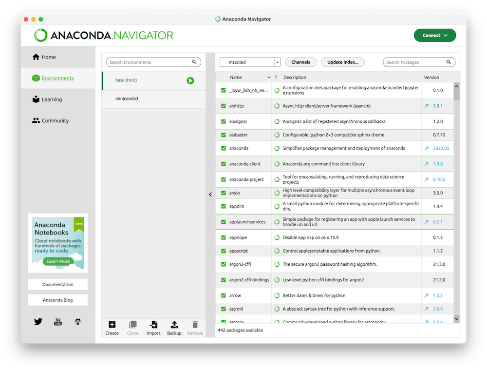

# Analyses-of-Environmental-Data-2

The course focuses on applying statistical models and machine learning methods to spatial data. The course will cover four topics:\
**1 Setting up your analytical envrionment** \
**1 Acquiring and wrangling real data** \
**2 Processing of spatial data with open source software** \
**3 Topographical modeling**  
**4 Implementing machine learning models on spatial data** 

After completing the course, the student should be able to:
*	Collect and prepare forest data from authorities such as the Swedish Forestry Agency and the Swedish Environmental Protection Agency for analysis.
*	Independently perform spatial modeling of forest land based on remote sensing data.
*	Identify and classify differences and similarities between statistics and machine learning for ecological data.
*	Compare some traditional machine learning models based on accuracy and calculation speed.
*	Combine machine learning with geographic data to produce maps of biological conditions for sustainable forestry.

# Table of  Contents

1. [Setting up your analytical envrionment](#Setting-up-your-analytical-envrionment)
   1. [Jupyter notebooks](##Jupyter-notebooks) 
         1. [With google colab](###with-google-colab) 
         2. [With your own hardware](###with-your-own-hardware)
   1. [Qgis](##Qgis)
2. [Processing of spatial data with open source software](#Processing-of-spatial-data-with-open-source-software)
   1. [Vector data](##Vector-data)
      1. [Geopandas](##Geopandas)
   2. [Raster data](##Raster-data)
      1. [Rasterio](##Rasterio)
      2. [Xarray](##xarray)
   3. [Satellite data](##Satellite-data)
      1. [Geemap](###Geemap)

3. [Topographical modeling](#Topographical-modeling)
   1. [Whittebox Tools](##Whittebox-Tools)
4. [Machine learning with spatial data](#Implementing-machine-learning-models-on-spatial-data)\
   1. [Random Forest](##Random-Forest)
   2. [Deep learning](##Deep-learning)

# Setting up your analytical envrionment
This course will only focus on free and open source tools which will always be accecible to you so you don't have to fight with the IT-department of your future employer. You will not need to pay for, or manage, expensive licens fees. In the first half of this course you used Rstudio to run R scripts but in order to work with Python scripts you need a Python envrinoment. 
## Jupyter notebooks
 Instead of Rstudio we will use Jupyter notebooks to analyze and interract with the data. The Jupyter Notebook is a web application for creating and sharing computational documents. It offers a simple, streamlined, document-centric experience. It supports over 40 programming languages, including Python, R, Julia, and Scala. In this crouse we will demonstrate two ways to set up notebooks. The easy way using google colab, and the fun way using your own computer.
### With google colab
Colab is a hosted Jupyter Notebook service that requires no setup to use and provides free access to computing resources, including GPUs and TPUs. All exercises in this course can be completed using google colab. However, colab is also quite slow due to limited hardware resources with about two processing cores and 12 GB of RAM. In order to get started with google colab you will need a google account and set up google drive for permanent storage. 

### With your own hardware
Real geospatial datasets are rappidly expanding in both scope and detail which requires more processing power to handle. In addition your future employer might not be to happy if you upload senstive data to google colab/drive. Therefore I strongly recomend that you learn how to set up your analytical environment on local hardware. As a bonus, you can finally motivate paying a premium for that fancy computer.

To get started you need to download and install [Anaconda](https://www.anaconda.com/download). Follow the instructions and accept all defaults. Once installed you can open Anaconda and it should look something like this. 

Look for the "create" button in the bottom and press it to create your first viritual environment. Once created the next step is to activate that enviromnet and going to "Home". Once on the Home screen you can select and install jupyter for your new environment. 

Once installed you can go back to the "environments" tab and click the green arrow next to your envrionment. Select "open with jupyter notebook".

you will then be greeted by a webpage with a little button in the top right corner saying "new". Click itt and select "python 3 ipykernel". Now you have set up a analytical envrionment on your own hardware. 

Enter the following lines in the first cell and run it to see how good your computer is:\
import multiprocessing\
cores = multiprocessing.cpu_count()\
cores

If the number of cores is less than four you should use google colab. You should also look for a new computer.  
# Processing of spatial data with open source software
## Vector data
### Geopandas

### Rasterio

### Xarray

## Raster data

## Satellite data
### Geemap

# Topographical modeling
## Whittebox Tools

# Machine learning with spatial data
## Random Forest

## Deep learning
